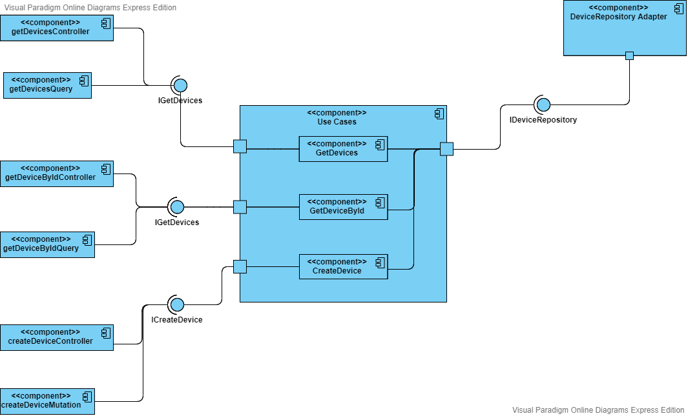

# device_management


## Table of contents

* [Documentation](#Documentation)
* [Technologies](#Technologies)
* [Deployment](#Deployment)
* [Examples](#Examples)
* [Testing](#Testing)


## Documentation

* Component Diagram

 

## Technologies

Project is created with:

* Typescript
* Node
* Express
* Express-graphql
* Graphql
* Mongo
* Docker
* Jest

## Deployment

> Note: The app will start with a seeder. 

```
$ docker-compose up -d
```

## Examples

>Service will be up and running on port 8070:

* Rest Endpoints

```
$ curl http://localhost:8070/devices
$ curl http://localhost:8070/devices/99b297dd-cb11-4513-b3b2-f798af12a83f
$ curl -d '{"name": "curlTest","firmwareRevision": "0.1.0","firmwareVersion": "1.1.0"}' -H "Content-Type: application/json" -X POST http://localhost:8070/devices
```
* Graphql playground examples

*Navigate to localhost:8070/graphql, Start to play around with these examples*
```graphql
#####Introspection Example 
{
  #Introspection all types available on the graph server, step1 
  __schema {
    types {
      name
    }
  }

  #Introspection Device type, its description and fields, step2
  __type(name: "Device") {
    name
    description
    kind
    fields {
      name
      type {
        name
        kind
      }
    }
  }
}
####

#####Query Example
{
  devices {
    deviceId
    name
  }
  device(deviceId: "a3eedb89-a923-4041-8f49-7e80d541486e") {
    name
  }
  # Trying out alias
  deviceDifferent: device(deviceId: "85214138-eb63-48e0-9d5e-75335433e6de") {
    name
     # Trying out fragment
    ...versionFields
  }
}

#defining fragment on Device type
fragment versionFields on Device {
  firmwareVersion
  firmwareRevision
}
####

###Mutation example
mutation CreateDeviceMutation($device:CreateDeviceInput) {
  createDevice(device:$device){
      name
  }
}

#Variable
{
  "device": {
    "name": "graphql test",
    "firmwareRevision": "1.0.0",
    "firmwareVersion": "1.0.0"
  }
}

####
```
	
## Testing

> 1.first get a bash shell in the container 
> 2.excute the test cases

```
$ docker-compose exec device bash
$ npm test
```

